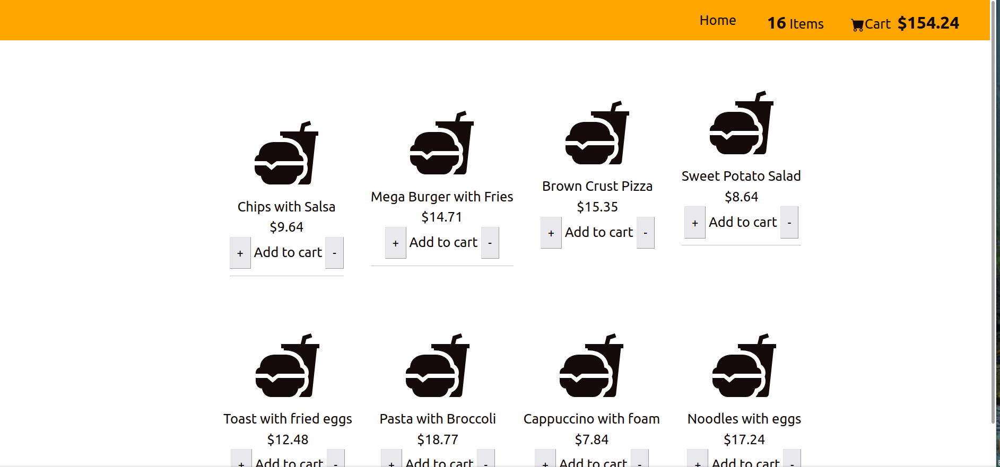

# Fodee

Food ordering dashboard app

## Why this app as created:

Proof of concept: This app was created as an example of React state, regular expressions, core Javascript functions and seamless U.X design.

## How to use:

1. Clone repo into desired directory `git clone https://github.com/Toughee/Fodee.git` or `gh repo clone Toughee/Fodee`
2. Run `npm install` in your terminal to install all app node modules and dependencies
3. Run `yarn start` in your terminal to run app on http://localhost:3000/

## Testing / Linter tools used for app:

-   React Testing library, Mocha, Jest and Cypress for testing components
-   TravisCI and CircleCI for CI/CD development
-   Prettier for keeping all code formatted and organized

## Project resources:

-   [Current roadmap for app](https://github.com/Toughee/Fodee/projects/1)
-   [Wiki page for app](https://github.com/Toughee/Fodee/wiki)
-   [Documentation for project contributors](https://github.com/Toughee/Fodee/tree/main/docs)

### Future app goals:

- [ ] Finalize code refactoring for all components inside app
- [ ] Add multiple tests for each React component
- [ ] Improve the app's UI design for a more responsive experience for mobile users
- [ ] Add menu items into an online database
- [ ] Add mock checkout procedure to simulate purchases

### Completed app tasks:

- [x] Refactor code and cut code volume. Divide all components into reusable React components
- [x] Add modal display after checkout is done to notify users of their checkout input
- [x] Include CircleCI and Travis-CI inside project
- [x] Improve UI and UX design for app
- [x] Perfect UI and UX design for app
- [x] Make app responsive for the majority of user platforms
- [x] Working checkout button for item and cart total
- [x] Make the checkout option become visible only if one item is in each item inside the menu list