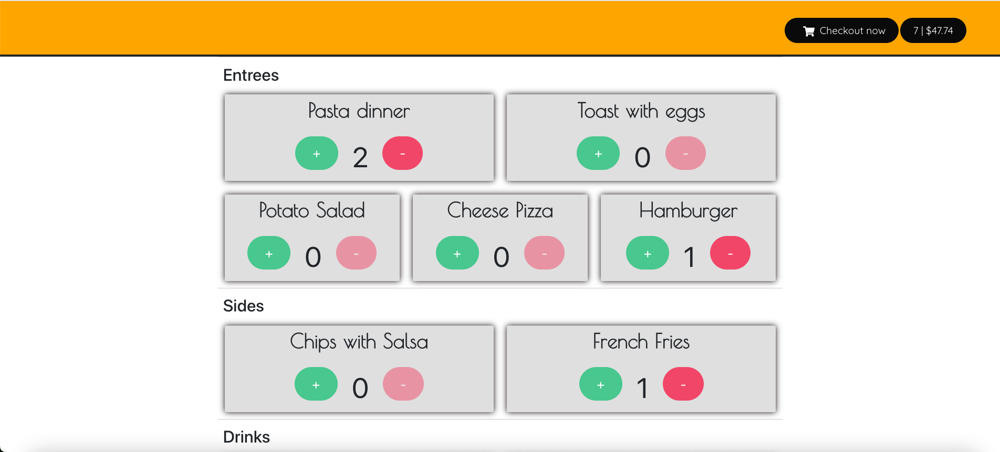
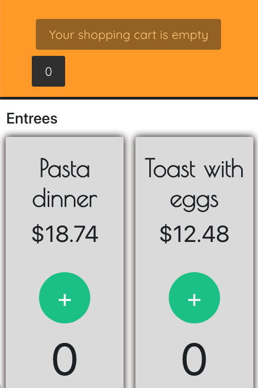

<div class="READMEstyling" align="center">

  

</div>

# Brunchin

An open source point of sale management system with a constantly expanding service platform. 

- [Why was this app created](#why-was-this-app-created)
- [App screenshots](#app-screenshots)
- [How to use](#how-to-use)
- [Testing tools used](#testing-tools-used-for-the-app)
- [Running automated tests](#running-automated-tests)
- [Project resources](#project-resources)
- [Completed tasks](#completed-tasks)
- [Upcoming app updates](#upcoming-app-updates)


## Why was this app created:

Brunchin was initially created as an example of an app using React state, regular expressions, core Javascript functions and seamless U.X design. But it has since evolved into a biggger project where multiple people are expected to contribute. Brunchin takes inspiration from Toast and Square's POS system and intends to offer some of it's features as an open source app which anybody can contribute and improve. 

Future updates will include a live website, as well as a subscription service available to users.

Brunchin is currently in development and is looking for any contributors to help with the dev cycle. Please see the [project resources section for more information](https://github.com/tjdev7/Brunchin/tree/main/docs)

## App screenshots:



### Mobile screenshot:

<div class="READMEstyling" align="center">

   

</div>

## How to use:

1. Clone repo into desired directory `git clone https://github.com/tjdev7/Brunchin.git` or `gh repo clone tjdev7/Brunchin`
2. Run `npm install` in your terminal to install all app node modules and dependencies
3. Run `yarn start` in your terminal to run app on http://localhost:3000/

## Testing tools used for the app:

-   React Testing library, Mocha, Jest and Cypress for testing components
-   TravisCI and CircleCI for CI/CD development
-   Prettier and ESlint for keeping all code formatted and organized

### Running automated tests:

- ```npm run linterclean``` to run Prettier tests
- ```npm run jesttests``` to run Jest tests
- ```npm run test``` to run local React Testing Library tests
- ```npm run litereport``` to run local Lighthouse tests
- ```npm run fullaudits``` to update local components and review if any packages are outdated

## Project resources:

-   [Current roadmap for the app](https://github.com/tjdev7/Brunchin/projects/1)
-   [Wiki page for the app](https://github.com/tjdev7/Brunchin/wiki)
-   [Documentation for project contributors](https://github.com/tjdev7/Brunchin/tree/main/docs)

### Completed tasks:

- [x] Add mock checkout procedure to simulate purchases
- [x] Refactor code and cut code volume. Divide all components into reusable React components
- [x] Add modal display after checkout is done to notify users of their checkout input
- [x] Include CircleCI and Travis-CI inside project
- [x] Improve UI and UX design for app
- [x] Make app responsive for the majority of user platforms
- [x] Working checkout button for item and cart total
- [x] Make the checkout option become visible only if one item is in each item inside the menu list

### Upcoming app updates
### Final Version 2 app updates:

- [ ] Finish refactoring code for all components inside app
- [ ] Add multiple test types (Unit testing, Integration testing, performance testing, usability testing, load caching, etc) for each React component
- [ ] Improve the app's UI design for a more responsive experience for mobile users
- [ ] Update app's performance and UI design for multiple browsers (Safari, Firefox, Opera, etc)
### Version 3 app updates

- [ ] Create custom menu items option for shop owners to change their menu with little hassle
- [ ] Connect app to an external database for better checkout simulation
- [ ] Improve app's responsive design
- [ ] Add touch functionalities and ARIA label options to React app
- [ ] Improve custom menu options inside app
